::: {.callout-note appearance="simple"}
**Working paper, September 2026.** [Download the PDF](Cuenat_Show_What_Changed.pdf){download="Cuenat_Show_What_Changed.pdf"}
:::

**Abstract.** Many organisations use AI to produce more: more metrics, more reports, more dashboards. And we end up looking at data. This paper argues that data is not what we need. A simple lesson from mathematics shows why more numbers explain the past better but guide decisions worse. The paper then argues that summarising data well and finding the rules behind it are the same task, and that the result is a shape: a small description of how a system works. Its main proposal is that the dashboard should show neither the data nor the shape, but the difference between today's shape and the previous one: what changed in our understanding. A simulated case based on the telemetry of an AI copilot shows the gain.

::: {.callout-tip appearance="simple" icon="false"}
## Key takeaways

- Data is not what we need, and producing more of it is not progress.
- Summarising data well and finding its rules are the same task. The result is a shape: our understanding of the system.
- The dashboard should show how the shape changed, not the data. Most of the time, it is empty.
- An empty dashboard is good news, but only if the system proves that it is still checking.
- Data becomes evidence: collected where things change, kept in an archive, rarely shown.
:::

# Part I · Data is not what we need

## 1. The dashboard problem

AI makes it cheap to produce information, so we produce more of it: more reports, more summaries, more tiles on dashboards that already have forty. But reading still takes as long as it always did. Human attention is the real limit.

And so we end up looking at data. The screen fills with numbers, and understanding is left to the reader. We measure more than ever, yet decisions do not feel better informed. This paper argues that data is not what we need, and that producing more of it is not progress. What we need is understanding and, above all, knowing when our understanding has to change.

## 2. The curve that fits too well

Imagine we have some noisy measurements and want to draw a curve through them. A common tool is a polynomial, a sum of terms:

$$
p(x) = a_0 + a_1 x + a_2 x^2 + \dots + a_n x^n
$$

The more terms we add, the closer the curve gets to each point. With enough terms, it passes through all of them. That looks perfect, but it is not. Between the points, the curve swings wildly (Figure 1). It has learned the noise, not the real shape.

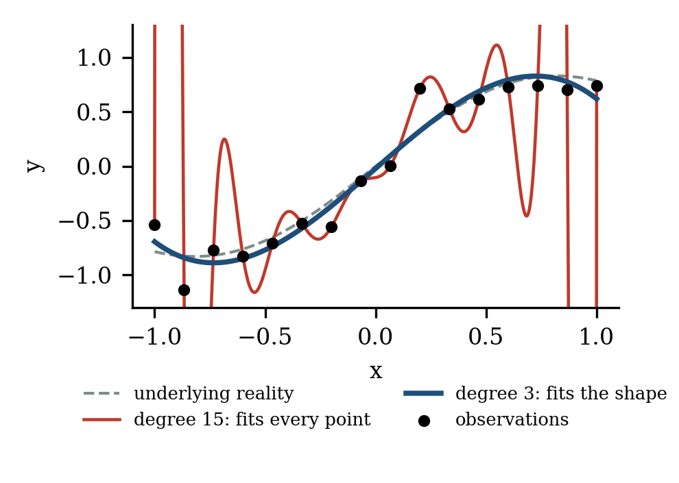

A dashboard does the same thing, except that the fitting happens in people's heads. Show someone forty indicators and they will find a story: this dip was caused by that event. With enough indicators, some story always fits the past. The reader becomes the curve with too many terms. That is why every extra number has a cost, even when it is correct.

## 3. Explaining the past vs. predicting the future

Figure 2 shows the trade-off. Adding terms always improves the fit to past data. But the ability to predict new cases improves only up to a point, and then gets much worse. The best result comes from a small number of terms.

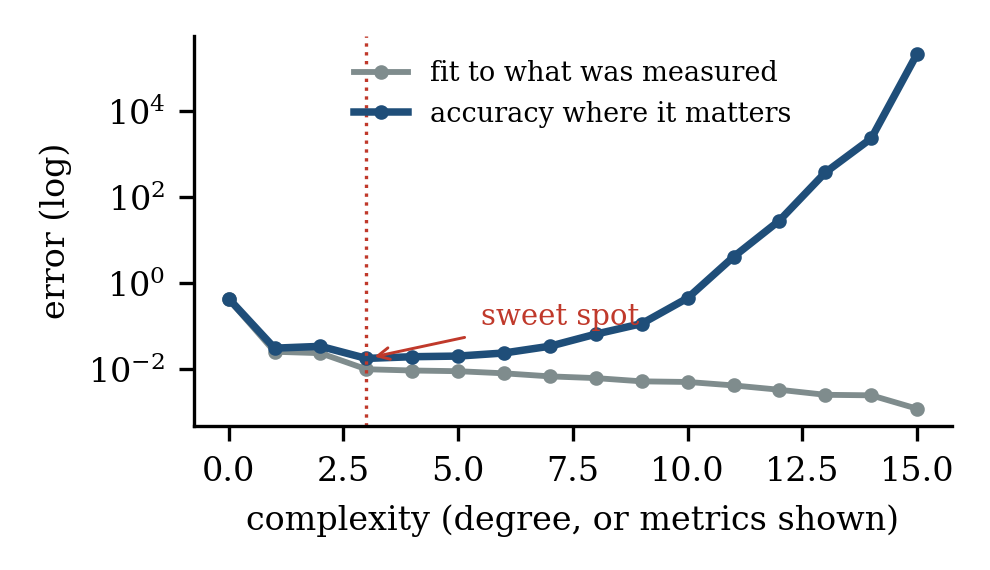

The same holds for dashboards. Three well-chosen numbers may look less complete than thirty, but they guide action better. Being complete and being accurate are not the same goal.

# Part II · Compression gives shape

## 4. Lots of data, few numbers

This does not mean we should collect less data. To find the few right numbers, we often need many measurements. The real question is who does the summarising. In Figure 3, 120 measurements are reduced to six numbers that describe the whole surface, even where nothing was measured. Machines should handle the volume; people should receive the result.

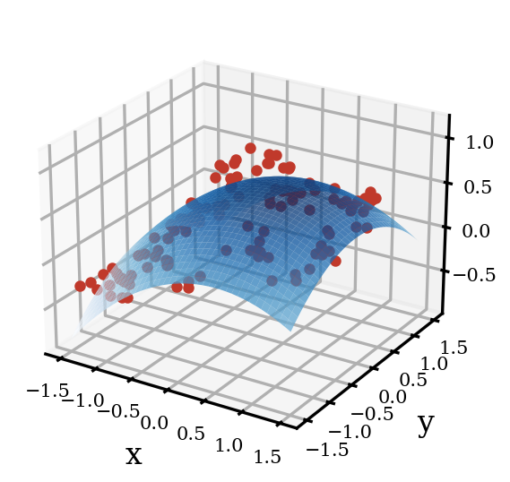{width=60%}

So the best use of AI here is not to produce more, but to reduce: to take large, messy data and return the few numbers that explain it, with an honest statement of how certain it is (Figure 4). Three simple tests help decide what to keep:

- **Decision test.** Would this change what anyone does? If not, remove it.
- **Prediction test.** Does it help predict what comes next, or does it only describe the past?
- **Simplicity test.** Could we say the same with fewer numbers? If so, the extra ones are noise.

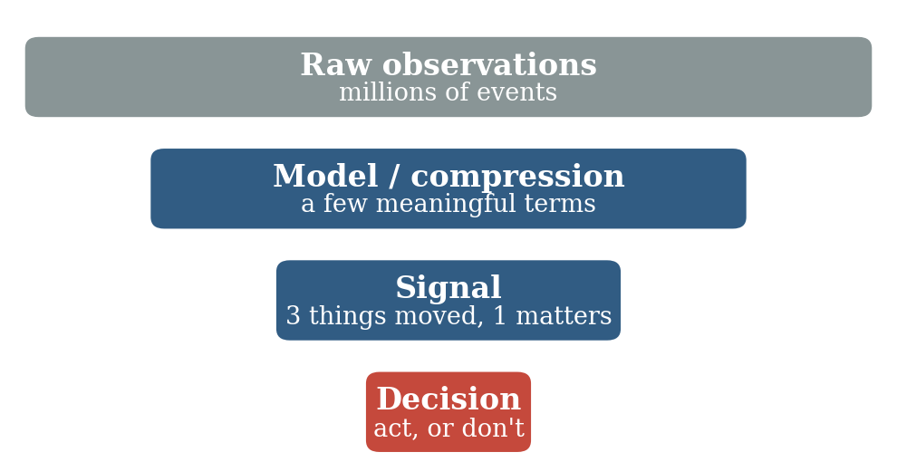

## 5. Summarising is discovering

A curve shows the shape of the data, but not why it has that shape. For that, we need rules. One might think that finding rules is a separate step that comes after summarising. It is not. It is the same task.

Here is why. The shortest way to describe a set of data has two parts: a rule, plus the exceptions the rule does not explain.

$$
\text{data} = \text{rule} + \text{exceptions}
$$

The best summary keeps both parts as short as possible, and the rule that achieves this is the best explanation of the data. Put simply: the raw data is a file, a summary is a compressed file, and a rule is the recipe that produces the file.

History shows this well. Tycho Brahe spent decades recording the positions of the planets. Kepler summarised his tables in three short laws. Newton then discovered gravity, not from Tycho's raw tables, but from Kepler's three laws. The rule was found in the summary, not in the raw data.

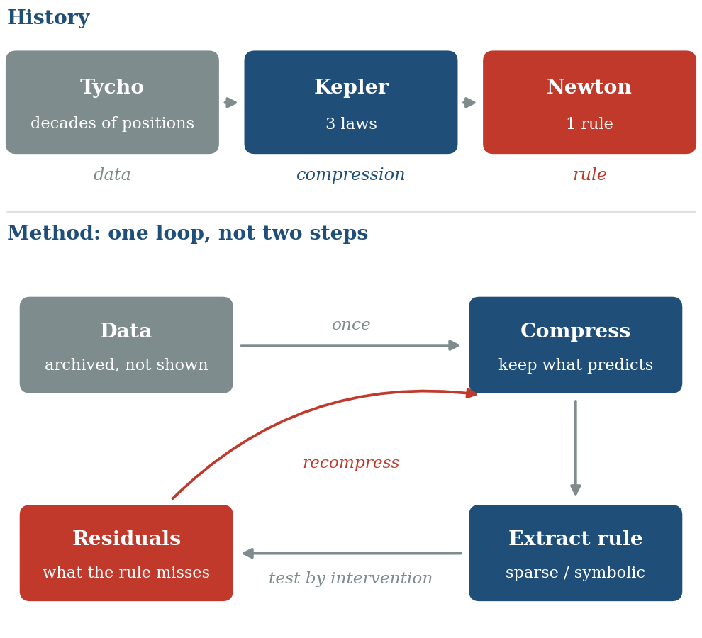

Modern AI can work the same way. First, a neural network learns to summarise the data into a few variables. Then a second method searches those few variables for simple equations. Researchers have used this to rediscover known laws of physics from raw measurements, even from video. So to the question "how would AI find the rules?", the answer is: summarise first, then look for rules in the summary.

Three cautions apply:

- **Keep what predicts, not what is big.** A summary that keeps only the largest effects can throw away a small signal that holds the rule.
- **It is a loop, not a straight line.** To summarise well, you need an idea of the rule; to find the rule, you need a good summary. So we go round: summarise, guess a rule, look at what it misses, summarise again.
- **A pattern is not a cause.** A rule found in past data may break once people act on it. As Goodhart's law puts it, when a measure becomes a target, it stops being a good measure. Rules must be tested in practice.

## 6. The shape of a system

We can now name what this work produces. Call it the *shape* of the system: the smallest description that explains its data. It has three layers.

- **Structure:** what kind of system it is. One group or several? Does it repeat in cycles, or drift?
- **Rules:** how it works. What drives what, and how strongly.
- **Scale:** a few key numbers that say how much.

Structure deserves a word, because averages cannot see it. In Figure 6, three datasets have exactly the same average and spread, yet one is a cloud, one is a loop and one is two loops. A process that repeats and a process that drifts are very different, even if their averages match. A branch of mathematics called topological data analysis detects such structure and describes it with a few numbers: how many groups, how many loops.

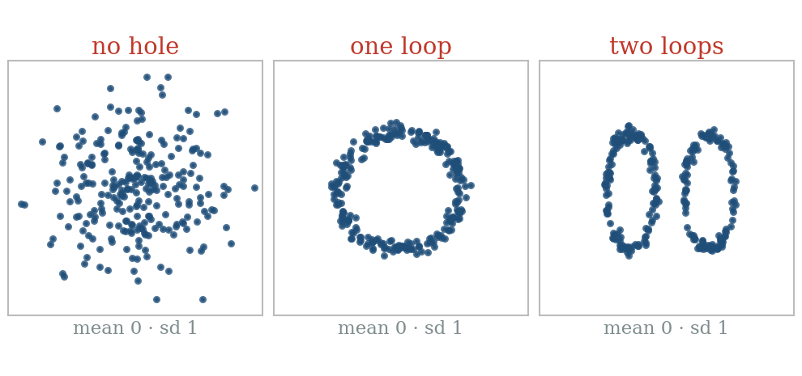

In practice, a shape fits on a small card of a few dozen numbers. It is our current understanding of the system. It is far smaller than the data, and far more useful.

# Part III · The dashboard is the difference of shapes

## 7. Show what changed, not what is

Here is the central idea of this paper. Data arrives all the time, so the shape is updated regularly, for example every week. Most weeks, the new shape is almost the same as the old one: the system behaves as we understand it. Occasionally the shape changes: a rule stops holding, a new group appears, a key number moves.

The dashboard should show exactly that: the difference between the new shape and the previous one.

$$
\text{dashboard} = \text{shape}(\text{this week}) - \text{shape}(\text{last week})
$$

Mathematicians call this a finite difference. The dashboard then shows neither the data nor even the shape, but how our understanding has changed (Figure 7).

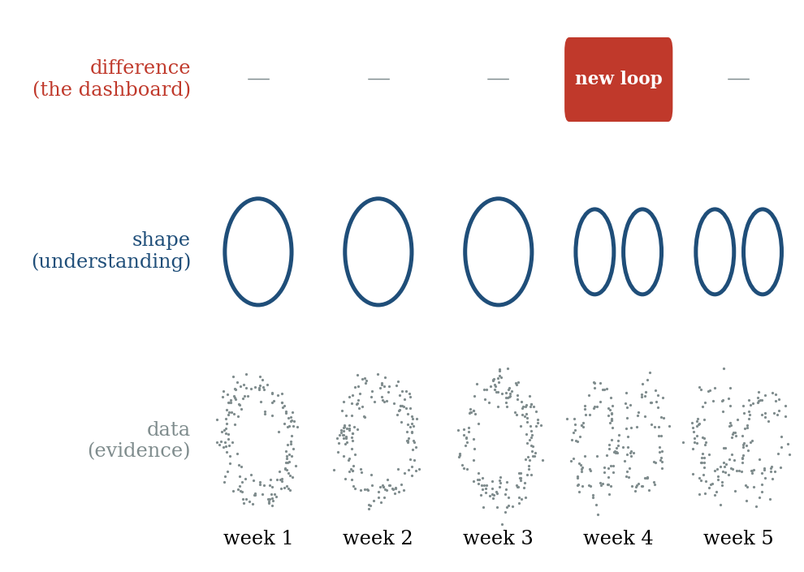

This gives three layers, each with its own role. **Data is evidence:** it is kept, but rarely shown. **The shape is understanding:** anyone can consult it when they want to know how the system works. **The difference is news:** it is the only thing that needs attention.

It also separates two kinds of surprise. A surprise *within* the shape is a single measurement that does not fit the rules: an unusual request, a bad day. The system handles those itself. A change *of* the shape means the rules themselves have moved. That is what people need to know.

Most of the time, the difference is zero and the dashboard is empty. That is the goal, not a flaw. An empty dashboard means our understanding still holds.

## 8. Five cautions for taking differences

The idea is simple, but taking differences has well-known traps. Each has a simple answer.

- **Differences amplify noise.** Subtracting two noisy numbers gives an even noisier one. If shapes are compared too often, random swings look like change. The time step must be long enough for the shape to be measured reliably. Mathematicians face the same choice when picking the step of a finite difference.
- **Subtract the change you already expect.** If usage grows every week, the raw difference shows growth every week. That is not news. The dashboard should show the difference minus what the rules predicted: the change of the change.
- **Compare like with like.** Two shapes can only be subtracted if they are described in the same terms. If the summary is rebuilt from scratch each time, its terms may shift meaning. Keep the frame fixed, or align the shapes before comparing.
- **Look at more than one time scale.** A slow drift can be too small to notice from one week to the next and still add up to a large change. Compare the shape not only with last week, but also with a fixed reference, such as last quarter.
- **Weigh change by what it affects.** A small change near a decision point can matter more than a large one elsewhere. Only changes large enough to affect a decision should appear, and the people who own the decisions, not the analysts, should decide what counts as large enough.

## 9. Data becomes evidence

In this view, data changes role. It is no longer something to look at. It is evidence: used to build the shape, to check it, and to show when it must change. Three ideas explain what kind of data is worth having.

**Information is surprise.** A number we already expected tells us nothing new. Only the gap between what happened and what the shape predicted carries information. A leading theory in brain science suggests the brain works in a similar way: it passes on mainly what differs from expectation.

**Measure where things change.** A rule tells us how things evolve; given a starting point, it can rebuild the rest. So data is needed mainly where the shape is unsure or changing. In Figure 8, the same 13 measurements, placed where the curve changes, give an error six times smaller. In practice we do not know in advance where things change, so we find out step by step: measure a little everywhere, then more where the surprises are.

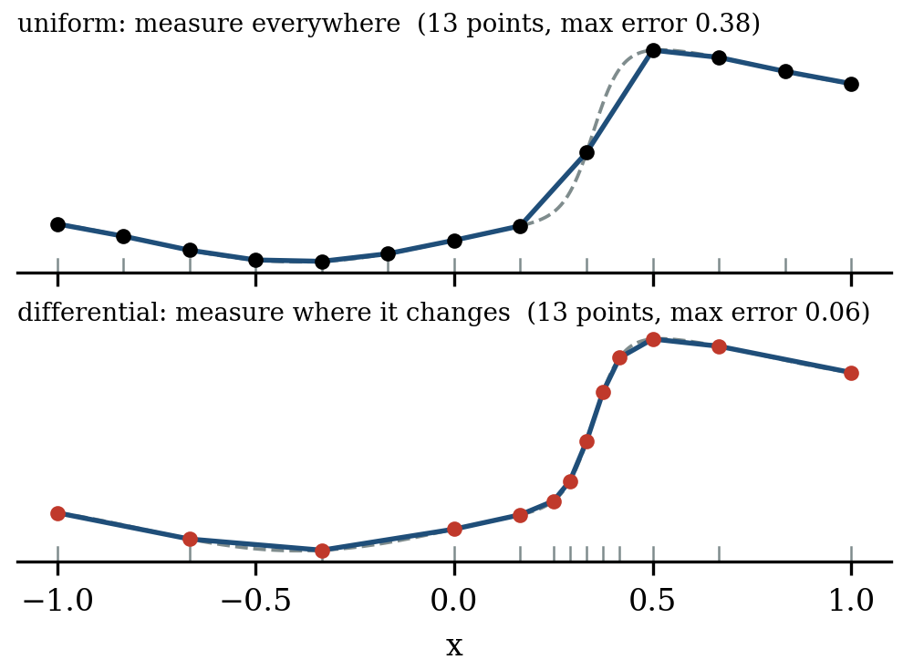

**Data is worth what it changes.** A measurement is valuable only if it could change a decision. When the choice is already clear, more data adds nothing (Figure 9). A good shape makes choices clearer, and so reduces how much data we need.

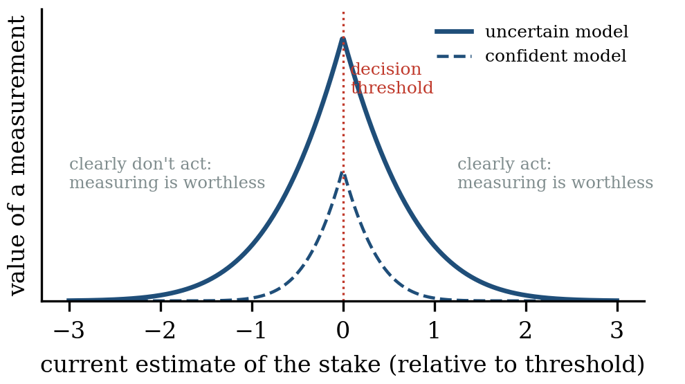

In practice: collect a little everywhere, and much more where the shape is changing. Keep the raw data in an archive for the day a new rule is needed. Show it only when someone asks.

## 10. What replaces the dashboard

What people see becomes small. The system produces three things:

- **A change notice,** when the shape changes in a way that matters: what changed, by how much, why it matters and what to do.
- **A heartbeat,** each period: "shape checked on this week's data, no material change." Without it, an empty dashboard is ambiguous, because a broken system is empty too.
- **The shape itself,** on demand, for anyone who wants to understand the system or ask a question.

Dashboards also serve other purposes: a shared picture for the team, accountability, audits and trust. These needs remain, and this approach serves them better. The shape is the shared picture. The history of changes is the audit trail. The heartbeat makes "nothing changed" a clear, checkable statement rather than a feeling.

There are real risks. People who stop watching can lose their feel for the system, and a system cannot see a change its shape does not describe. Three safeguards help: review the shape itself regularly; let people explore the raw data from time to time, looking for what the shape misses; and keep people, not the system, responsible for the limits and the decisions.

Building such a system follows a short method:

- **Start from decisions.** List the decisions people actually make.
- **Compress into a shape that predicts.** Keep what predicts, and let each rule know its own noise.
- **Fix the frame,** so that shapes can be compared over time.
- **Choose the step,** long enough to measure the shape reliably.
- **Compute the difference minus the expected change,** against last period and against a fixed reference.
- **Keep only material changes,** publish them with a heartbeat, and archive the data.

## 11. A simulated case: copilot telemetry

To make this concrete, we simulated 90 days of telemetry from an AI copilot with five agents: search, code, summarise, translate and email. Each request records its language (English, German, French or Italian), the agent, the function used, the request length and the response time. Usage grows slowly and drops at weekends, and a new export function is gradually replacing the older draft function. Response times also move up and down each day for everyone, because the servers are shared.

We hid two real problems. From day 45, the translate agent starts slowing down very gradually, by 0.2% per day. On day 60, the code agent suddenly becomes 25% slower, for German requests only. In total, the simulation produces 1.6 million requests and about 10 million numbers.

**The usual dashboard.** A typical dashboard shows 24 tiles: requests per language and per agent, response time per agent, and how often each function is used (Figure 10). Each tile is flagged when it leaves its normal range. Over the last 60 days, the tiles raise 106 flags. Normal growth and the new export function look like anomalies. Each real problem is flagged just once, both on day 74 during a server spike, with nothing to set them apart from the 104 false flags. Neither cause is named. This baseline is deliberately simple. A careful analyst would adjust each tile for weekends and growth, and remove most of the false flags. But the two real problems would still be hidden in the daily server swings, and no tile would name the cause.

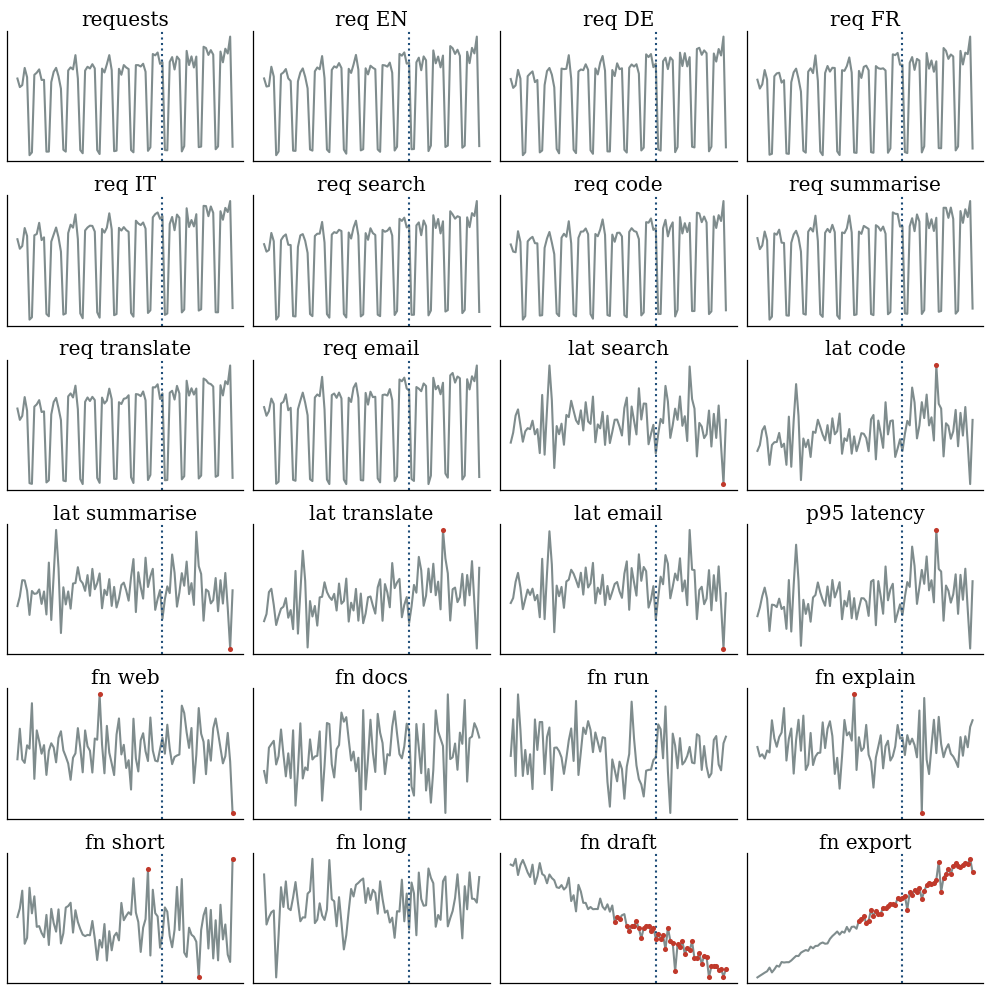

**The shape.** The system first summarises the raw requests into 7,200 small groups, one per day, agent, language and request length. From this summary it learns the rules: weekdays bring four times more requests than weekends; usage grows by about 0.3% per day; export is steadily replacing draft; and response time grows with the square root of request length (learned value 0.54, against 0.5 used to create the data). Each week, it then describes the copilot with a shape card of 33 numbers: overall volume, the language mix, the speed of each agent in each language (after removing the effect of request length and the shared server swings), and the share of each function within its agent. Twelve weeks of shapes amount to fewer than 400 numbers, instead of 10 million.

**The dashboard.** Figure 11 shows the difference between each week's shape and the previous one. On the left is the raw difference: many cells light up week after week, because volume grows and export replaces draft. On the right is the difference minus the expected change, keeping only material changes (5% for speed and volume, two percentage points for usage). These thresholds are not technical choices; they should be set by the people who own the decisions, for example the team responsible for response times. For twelve weeks, the whole dashboard is empty except for one line: code agent, German. The notice appears at the end of week 9, two days after the problem began, and names the cause. It appears again in week 10, because the week-9 shape contained only three days of the problem. After that, the new speed is part of the shape, and the dashboard is quiet again.

**The slow drift.** The translate slowdown never moves more than 1.7% from one week to the next, so it never appears on the weekly dashboard. Compared with a fixed reference shape (weeks 1 to 6), it crosses the 5% line in week 12 and is reported (Figure 12). This is the fourth caution at work.

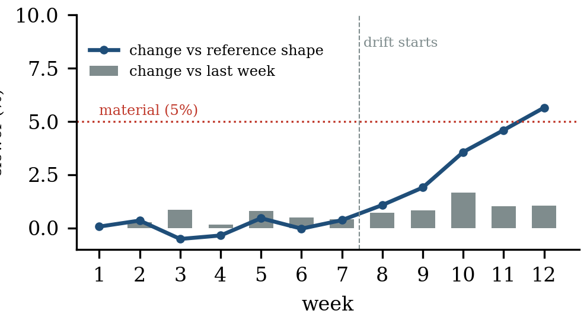

**The time step.** If shapes are compared every day instead of every week, noise alone produces 51 speed changes above 5% in the first 59 days, before anything real has happened. Weekly comparison produces none. This is the first caution at work.

**A limit.** We hid both problems along dimensions the shape card tracks: agent and language. A problem along a dimension it does not track, such as device type, would not appear at all. This is the real limit of the approach, and the reason why the shape itself must be reviewed, and the raw data explored from time to time (Section 10).

|                                  | Usual dashboard               | Difference of shapes          |
|----------------------------------|-------------------------------|-------------------------------|
| What people see                  | 24 charts, every day          | 12 heartbeats, 3 notices      |
| False alarms                     | 104                           | 0                             |
| Sudden problem found             | day 74, one flag among many   | end of week 9 (day 62)        |
| Cause named                      | no                            | code agent, German            |
| Slow drift found                 | day 74, one flag among many   | week 12, via the reference    |
| What is kept for understanding   | 24 charts                     | 33 numbers per week           |

: **Table 1.** The two approaches on the same simulated data. The dashboard figures cover 90 days, the shapes 12 full weeks. The 3 notices are two for the sudden problem (weeks 9 and 10) and one for the drift.

Two lessons came from building the case itself. Our first summary dropped request length, and the length rule could not be found: the system learned 0.33 instead of 0.5. *A summary must keep what predicts.* An early version also ignored that weekends have fewer requests, which makes usage noisier on those days; it raised ten false alarms. *A rule must know its own noise.* Both are the loop of Section 5 at work: the surprises showed us what the shape was missing.

The gain is clear. People no longer read data. They read, at most, a few lines about what changed in the system, and a weekly confirmation that nothing else did. The data is still there, used as evidence rather than shown as content.

## 12. Conclusion

We set out from a simple observation: AI makes it easy to produce more, and we end up looking at data. Data is not what we need. What we need is understanding, and the ability to notice when it must change. Summarising data well and finding the rules behind it are one task, and its result is a shape. The dashboard, finally, should be the difference between shapes: an empty page on most days, and a few precise lines when our understanding of the world has to move. We do not need more data on more screens. We need a good shape, a careful way of measuring how it changes, and the humility to keep checking that it still holds.

## Further reading

::: {.small}
- Akaike, H. (1974). A new look at the statistical model identification. *IEEE Transactions on Automatic Control*, 19(6), 716–723.
- Anscombe, F. J. (1973). Graphs in statistical analysis. *The American Statistician*, 27(1), 17–21.
- Bainbridge, L. (1983). Ironies of automation. *Automatica*, 19(6), 775–779.
- Berger, M. J., & Oliger, J. (1984). Adaptive mesh refinement for hyperbolic partial differential equations. *Journal of Computational Physics*, 53(3), 484–512.
- Brunton, S. L., Proctor, J. L., & Kutz, J. N. (2016). Discovering governing equations from data by sparse identification of nonlinear dynamical systems. *PNAS*, 113(15), 3932–3937.
- Carlsson, G. (2009). Topology and data. *Bulletin of the American Mathematical Society*, 46(2), 255–308.
- Champion, K., Lusch, B., Kutz, J. N., & Brunton, S. L. (2019). Data-driven discovery of coordinates and governing equations. *PNAS*, 116(45), 22445–22451.
- Cranmer, M., et al. (2020). Discovering symbolic models from deep learning with inductive biases. *Advances in Neural Information Processing Systems*, 33.
- Edelsbrunner, H., Letscher, D., & Zomorodian, A. (2002). Topological persistence and simplification. *Discrete & Computational Geometry*, 28, 511–533.
- Goodhart, C. A. E. (1975). Problems of monetary management: the U.K. experience. *Papers in Monetary Economics*, Reserve Bank of Australia.
- Howard, R. A. (1966). Information value theory. *IEEE Transactions on Systems Science and Cybernetics*, 2(1), 22–26.
- Matejka, J., & Fitzmaurice, G. (2017). Same stats, different graphs. *Proceedings of CHI 2017*, 1290–1294.
- Miller, G. A. (1956). The magical number seven, plus or minus two. *Psychological Review*, 63(2), 81–97.
- Rao, R. P. N., & Ballard, D. H. (1999). Predictive coding in the visual cortex. *Nature Neuroscience*, 2(1), 79–87.
- Rissanen, J. (1978). Modeling by shortest data description. *Automatica*, 14(5), 465–471.
- Runge, C. (1901). Über empirische Funktionen und die Interpolation zwischen äquidistanten Ordinaten. *Zeitschrift für Mathematik und Physik*, 46, 224–243.
- Shannon, C. E. (1948). A mathematical theory of communication. *Bell System Technical Journal*, 27(3), 379–423.
- Tishby, N., Pereira, F. C., & Bialek, W. (1999). The information bottleneck method. *Proceedings of the 37th Allerton Conference on Communication, Control and Computing*, 368–377.
- Udrescu, S.-M., & Tegmark, M. (2020). AI Feynman: a physics-inspired method for symbolic regression. *Science Advances*, 6(16), eaay2631.
:::
